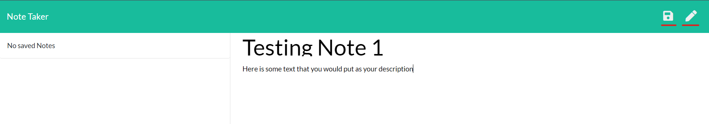
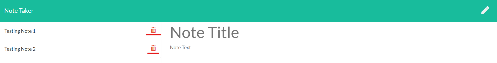

# Note-Taker

https://stark-sands-14737.herokuapp.com/

## Description

Note Taker is an application that utilizes Express and manages a web interface with user inputs. The user's information is saved onto the server. 

## Table of Contents

-   [Description](#description)
-   [Usage](#usage)
-   [Contributing](#contributing)
-   [Questions](#questions)

## Usage

1. Go to [Note Taker](https://stark-sands-14737.herokuapp.com/)
2. Once the home page is loaded, click on "Get Started" to see all saved notes

	

3. To create a new note, click the pencil icon and fill in the necessary information. Once complete, click the save icon to save your note. 
	

4. To delete a note, click on the trash icon on the left to remove any notes.  
    

5. To view all notes, click on the note titles on the left.
    

## Contribution

#### Contributors

[Melissa Tan](https://github.com/melissa-tan)

## Questions

If you have any questions or see any issues, please submit an [issue](https://github.com/melissa-tan/Note-Taker/issues) on GitHub!
